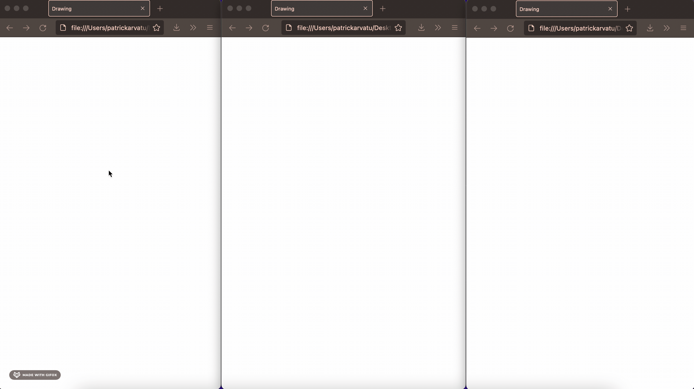

[](https://golang.org)
<a href="https://golang.org"></a>

# Drawing-App
This project was made to refresh my memory on websockets and on centralised hubs.



# Run
> Must have go installed.
### Step 1: [Fork the repo](https://github.com/Lambels/drawing-app/fork).
### Step 2: Run the server.
Mac/Linux
```
go run *.go
```
Windows
```
go run .
```
### Step 3: Open as many clients.
Open the [index.html](client/index.html) file in your browser as done in the demo.
> Note: Each client gets assigned a random and unique color.

# Run (Docker)
> Must have docker installed.
### Step 1: Clone the repo
### Step 2: Build the docker image from source:
```
docker build -t drawing-app ./path/to/dockerfile
```
### Step 3: Run a docker container:
```
docker run -p 8080:8080 drawing-app
```
> `Ctrl-c` to quit
### Step 4: Open as many clients.
Open the [index.html](client/index.html) file in your browser as done in the demo.
> Note: Each client gets assigned a random and unique color.